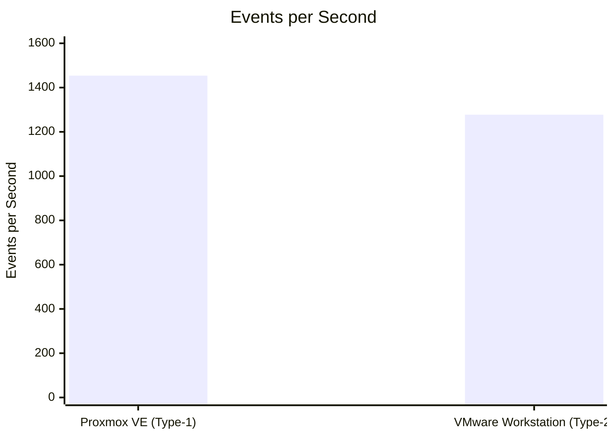
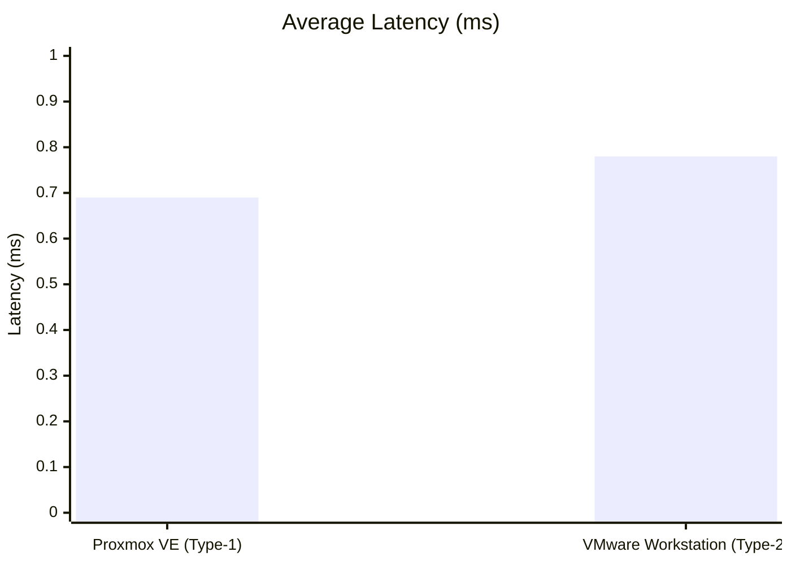
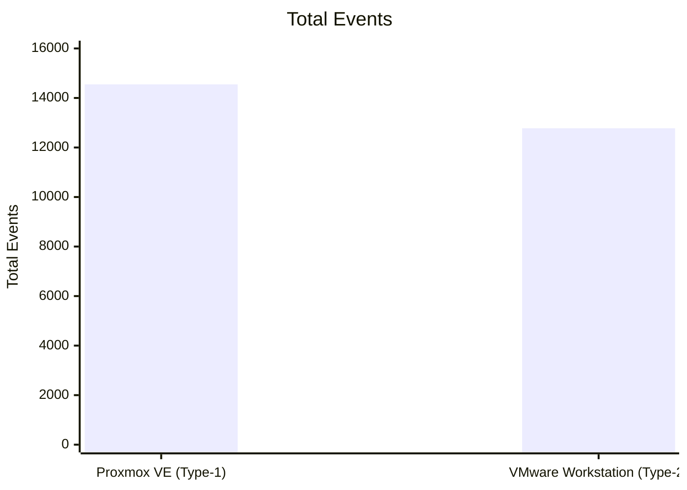
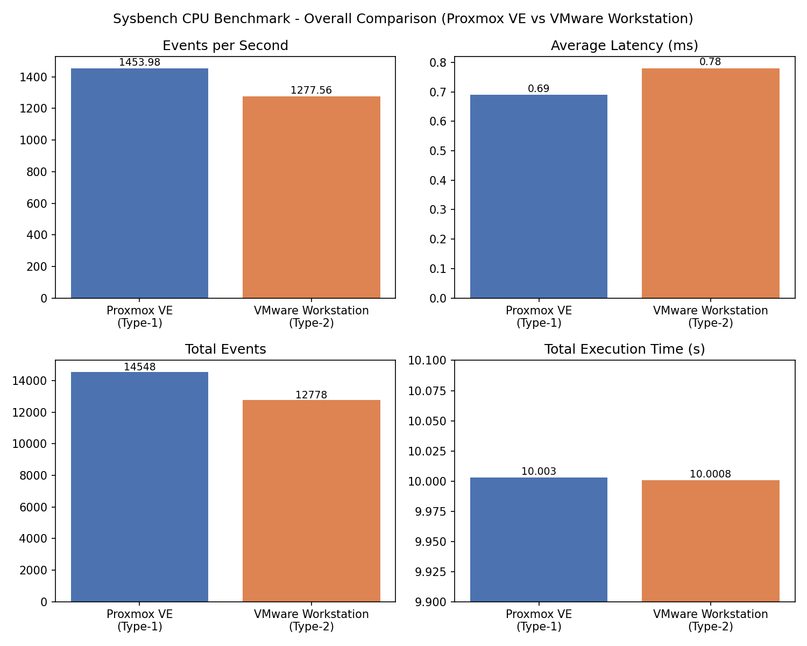

# Comparison - Type-1 vs Type-2 Hypervisor

This folder has the comparison graphs and result comparison between Proxmox VE (Type-1) and VMware Workstation (Type-2).

## Performance Comparison Table

| | Type-1 (Proxmox VE) | Type-2 (VMware Workstation) |
|---|---|---|
| Total Execution Time | 10.0030s | 10.0008s |
| Total Events | 14548 | 12778 |
| Events per Second | 1453.98 | 1277.56 |
| Average Latency | 0.69 ms | 0.78 ms |

## Metric Explanations

- **Total Execution Time**: how long the Sysbench test ran for. Both tests ran for close to 10 seconds.
- **Total Events**: total number of prime number calculations completed during the test. Higher is better.
- **Events per Second**: how many calculations were done per second (throughput). Higher is better.
- **Average Latency**: the average time taken per event. Lower is better.

## Graphs

## Graphs

### Chart 1: CPU Throughput Comparison (Events per Second)

### Chart 2: Average Latency Comparison (ms)

### Chart 3: Total Events Comparison

## Technical Analysis & Discussion

Proxmox VE performed better in this test because it is a Type-1 hypervisor, which means it runs directly on the physical hardware. VMware Workstation is a Type-2 hypervisor, which runs on top of a host operating system, so the guest VM's requests have to pass through an extra layer (the host OS) before reaching the hardware. This extra layer adds some overhead, which is likely why VMware Workstation showed lower throughput and higher latency compared to Proxmox VE in this experiment.

## Which is Better

In this test, Proxmox VE (Type-1) gave a higher events per second (1453.98) than VMware Workstation (Type-2) (1277.56), and also had lower average latency (0.69 ms vs 0.78 ms). So for this Sysbench CPU test, Proxmox VE performed better than VMware Workstation.

Note: Both VMs had the same configuration (2 vCPU, 2 GB RAM, 20 GB disk), so this is a fair comparison for this one test.
