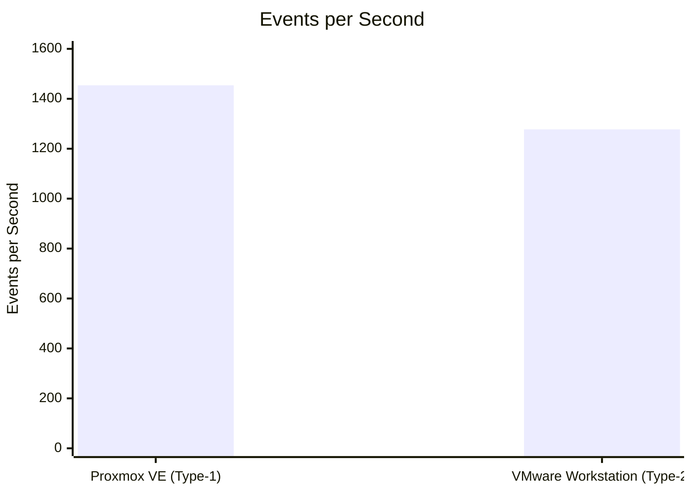
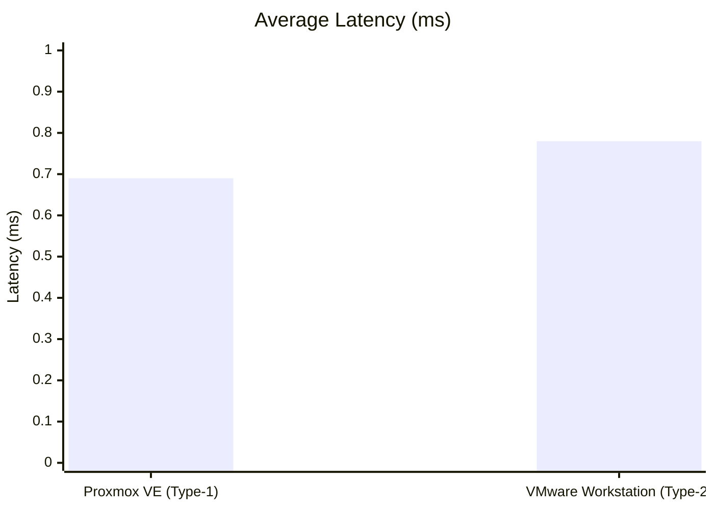
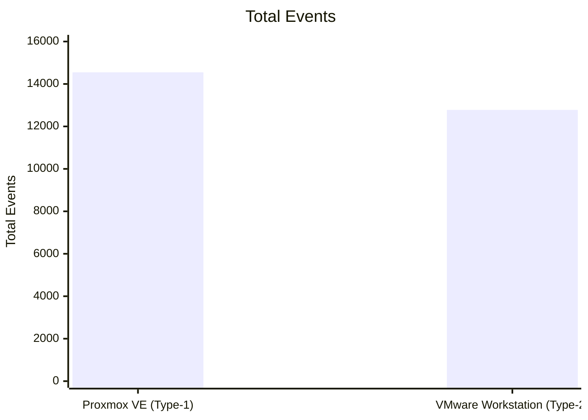

# Performance Analysis of Type-1 and Type-2 Hypervisors

Cloud Computing Lab experiment - Proxmox VE vs VMware Workstation

---

## Objective

In this experiment I made the same Ubuntu VM on a Type-1 hypervisor and a Type-2 hypervisor. Then I ran a Sysbench CPU test on both and compared the results.

## Hypervisors Used

- Type-1: Proxmox VE
- Type-2: VMware Workstation

Proxmox VE runs on a physical server and I used it from the browser. VMware Workstation runs on top of a host operating system.

## VM Configuration

I used the same configuration on both:

- OS: Ubuntu
- CPU: 2 vCPU
- RAM: 2 GB
- Disk: 20 GB
- Benchmark: Sysbench

Sysbench command:

```bash
sysbench cpu --cpu-max-prime=20000 run
```

---

## Type-1: Proxmox VE

### Login

- Opened `https://<PROXMOX_SERVER_IP>:8006` in the browser
- A security warning came because of the self-signed certificate, so I clicked Advanced and then Proceed
- Logged in with the given credentials

### VM Settings

I clicked Create VM and used these settings:

- Name: `CC-Experiment1-Type1`
- OS: Ubuntu ISO, storage `local`
- Disk: 20 GB (`local-lvm`)
- CPU: 1 socket, 2 cores (2 vCPU)
- Memory: 2048 MiB (2 GB)
- Network: bridge `vmbr0`
- System tab: left as default

### After Creating the VM

- Started the VM and opened the Console
- Installed Ubuntu and logged in
- Checked the VM with `hostnamectl`, `lscpu`, `free -h`, `df -h` and `top`
- Installed Sysbench and ran the benchmark:

```bash
sudo apt update
sudo apt install sysbench -y
sysbench --version
sysbench cpu --cpu-max-prime=20000 run
```

- Checked CPU, memory, network and disk usage in the Summary page of the VM
- Shut down the VM using `sudo poweroff`

### Screenshots

More screenshots and details are in the [Type-1-Proxmox](Type-1-Proxmox) folder.

---

## Type-2: VMware Workstation

### VM Settings

I opened VMware Workstation, clicked Create a New Virtual Machine and used these settings:

- Configuration: Typical (recommended)
- Installer disc image file (iso): Ubuntu ISO
- Guest OS: Linux, Ubuntu 64-bit
- Name: `CC-Experiment1-Type2`
- Disk: 20 GB
- In Customize Hardware:
  - Memory: 2048 MB (2 GB)
  - Processors: 1 processor, 2 cores (2 vCPU)
  - Network Adapter: NAT

### After Creating the VM

- Powered on the VM and installed Ubuntu (computer name `cc-type2-vm`)
- Restarted and logged in
- Checked the VM with `hostnamectl`, `lscpu`, `free -h`, `df -h` and `top`
- Installed Sysbench and ran the benchmark:

```bash
sudo apt update
sudo apt install sysbench -y
sysbench --version
sysbench cpu --cpu-max-prime=20000 run
```

- Checked the hardware settings under VM, then Settings
- Shut down the VM using `sudo poweroff`

### Screenshots

More screenshots and details are in the [Type-2-VMware](Type-2-VMware) folder.

---

## Results

### Type-1: Proxmox VE

- Total Execution Time: 10.0030s
- Total Events: 14548
- Events per Second: 1453.98
- Average Latency: 0.69 ms

### Type-2: VMware Workstation

- Total Execution Time: 10.0008s
- Total Events: 12778
- Events per Second: 1277.56
- Minimum Latency: 0.65 ms
- Average Latency: 0.78 ms
- Maximum Latency: 7.56 ms

## Performance Comparison Table

| | Type-1 (Proxmox VE) | Type-2 (VMware Workstation) |
|---|---|---|
| Total Execution Time | 10.0030s | 10.0008s |
| Total Events | 14548 | 12778 |
| Events per Second | 1453.98 | 1277.56 |
| Average Latency | 0.69 ms | 0.78 ms |

Comparison graphs and full details are in the [Comparison](Comparison) folder.

Observation: In this test, Proxmox VE (Type-1) gave a higher events per second (1453.98) than VMware Workstation (Type-2) (1277.56), and also had lower average latency (0.69 ms vs 0.78 ms). Both VMs had the same configuration (2 vCPU, 2 GB RAM, 20 GB disk).

## Metric Explanations & Visualizations

- **Total Execution Time**: how long the Sysbench test ran for. Both tests ran for close to 10 seconds.
- **Total Events**: total number of prime number calculations completed during the test. Higher is better.
- **Events per Second**: how many calculations were done per second (throughput). Higher is better.
- **Average Latency**: the average time taken per event. Lower is better.

### Chart: CPU Throughput Comparison (Events per Second)



### Chart: Average Latency Comparison (ms)



### Chart: Total Events Comparison



## Technical Analysis & Discussion

Proxmox VE performed better in this test because it is a Type-1 hypervisor, which means it runs directly on the physical hardware. VMware Workstation is a Type-2 hypervisor, which runs on top of a host operating system, so the guest VM's requests have to pass through an extra layer (the host OS) before reaching the hardware. This extra layer adds some overhead, which is likely why VMware Workstation showed lower throughput and higher latency compared to Proxmox VE in this experiment.

## Commands Used

```bash
hostnamectl
lscpu
free -h
df -h
top
sudo apt update
sudo apt install sysbench -y
sysbench --version
sysbench cpu --cpu-max-prime=20000 run
sudo poweroff
```

## Conclusion

I made the same VM (2 vCPU, 2 GB RAM, 20 GB disk, Ubuntu) on Proxmox VE and VMware Workstation and ran the same Sysbench CPU test on both. In this test, Proxmox VE performed better in terms of events per second and average latency compared to VMware Workstation, which matches what is expected for a Type-1 (bare-metal) hypervisor compared to a Type-2 (hosted) hypervisor.

## Repository Structure & Reproduction

- `README.md` - main file with the steps and results
- `LAB_REPORT.md` - formal lab report
- `Type-1-Proxmox` - screenshots and result of Proxmox VE
- `Type-2-VMware` - screenshots and result of VMware Workstation
- `Comparison` - comparison table, graphs and observation

To reproduce this experiment: create an Ubuntu VM with the same configuration (2 vCPU, 2 GB RAM, 20 GB disk) on both a Type-1 and a Type-2 hypervisor, install Sysbench, and run `sysbench cpu --cpu-max-prime=20000 run` on both.
